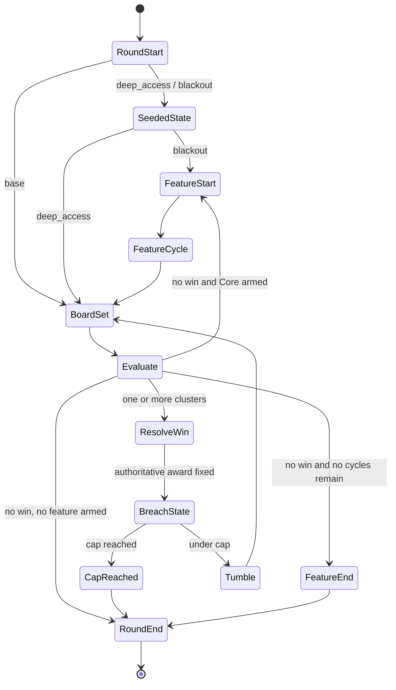

# BLACKSITE // BREACH — M1 Game, Math & Event Contract

Status: **M1 COMPLETE — INITIAL NON-RELEASE MATH CANDIDATE VERIFIED**
Contract version: `blacksite-m1-v1`
Book-event version: `blacksite-book-events-v1`
Freeze date: **2026-08-07**

Verified initial-candidate evidence: 300,000 books, 90/90 automated math/package/risk gates, 48/48 deterministic math fixtures and 7/7 tests. Candidate fingerprint: `d03fab2727e046eb6a151e579c4852cbb0536415b37028dcb3d2de9c99f278d8`. Typed event-schema hash: `bb4f3ff88200519682a539909b196f1462069b865a48afd04cb3219e7b9efe29`. Canonical evidence lives in:

- `math/games/blacksite_breach/library/publish_files/VERIFY_RESULT.json`
- `math/games/blacksite_breach/library/publish_files/CANDIDATE_MANIFEST.json`
- `math/games/blacksite_breach/library/publish_files/MATH_AUDIT.json`
- `math/games/blacksite_breach/library/publish_files/RISK_AUDIT.json`
- `math/games/blacksite_breach/library/publish_files/FIXTURE_INDEX.json`
- `math/games/blacksite_breach/config/event_schema.json`

This evidence closes Gate B for M1 only. It is not a release candidate, frontend proof, manual 3-star verdict or Stake approval.

This document freezes the reversible M1 product, math, event, presentation and compliance interfaces for the initial BLACKSITE candidate. A frozen contract is not a release approval: candidate audits, frontend implementation, exact-package QA, manual art review and Stake approval remain separate gates.

## 1. Authority and non-negotiable invariants

- Every paid play is one stateless, player-independent RGS round selected from fixed books and weights.
- The selected book, lookup payout and RGS result are payout authority. The frontend does not derive clusters, connectivity, multipliers or settlement.
- All payout-bearing book/event fields use integer **centi-x**. `100` means `1.00x`; wallet/API money remains integer micro-units at `1e6` and never appears in a book event.
- Board serialization is column-major: `board[column][row]`. A position is `{ "column": 0..6, "row": 0..6 }`; no `{x,y}` alias is valid.
- Event indices are zero-based, contiguous and strictly ordered. Live play, restore and Replay consume the same validated event stream.
- A presentation failure may skip/fallback visually, but cannot alter event order, payout, round state or settlement.
- The entire natural or direct BLACKOUT feature belongs to the originating play and round. It is never a second paid request.

## 2. Frozen product decisions

| Field | Frozen v1 value |
|---|---|
| Working title | `BLACKSITE // BREACH`; legal/uniqueness/manual clearance remains `REVIEW_REQUIRED` |
| Board | `7 × 7`, column-major |
| Regular symbols | Exactly `byte`, `relay`, `proxy`, `cipher`, `daemon`, `vault`; no Wild, Scatter, Mystery or payout/trigger special symbol |
| Win rule | Orthogonally connected cluster of `5+` identical regular symbols |
| Simultaneous wins | Evaluate all disjoint qualifying clusters from one immutable pre-evaluation board/state snapshot |
| Cascade | Award wins, update breach/route state, remove every winning position, tumble within each column, fill, then evaluate again |
| Route system | Persistent round-local `sealed` / `breached_dormant` / `breached_live` underlay, called the **Ghost Route** |
| Feature trigger | The Core underlay becomes live; there is no Scatter count |
| Feature | **BLACKOUT PROTOCOL**, 6 starting cycles, up to 12 through one-time port extensions |
| Max Win | `10,000.00x` raw, exactly `1,000,000` centi-x, in every mode |
| Target RTP | `0.962000` cost-normalized in every mode |
| Quality target | Stake 3-star verification profile plus project-internal stricter tail handling |

The canonical lowercase symbol IDs are `byte`, `relay`, `proxy`, `cipher`, `daemon` and `vault`. Display names may be localized aliases, but books, schema, config, events, fixtures and frontend adapters use only those IDs. The exact cluster-size paytable is canonical in the generated M1 math registry/config. Rules and frontend must import or mechanically verify those values; prose or UI may not maintain a divergent hand-authored table.

## 3. Board, clusters and tumble

1. A board is seven arrays of seven canonical symbol IDs: `board[column][row]`.
2. Adjacency is four-way only: up, down, left and right. Diagonals never connect a cluster.
3. A regular symbol pays when its connected component contains at least five cells.
4. Each board position belongs to at most one simultaneous component. All qualifying components are evaluated against the same board, Ghost Route and multiplier snapshot.
5. A cluster's unmultiplied award is selected from the canonical symbol/cluster-size paytable. Size bands must be exhaustive through 49 cells.
6. Only after all simultaneous awards are frozen may their positions change the Ghost Route.
7. All winning positions are removed together. Remaining symbols fall toward increasing `row`; replacement symbols enter from the top of their column. The `tumble` event and following `board_set` snapshot are authoritative.
8. Cascades continue until a `board_set` has no qualifying cluster, the Max Win cap stops the round, or the feature/round state machine ends.

## 4. Ghost Route topology

### Fixed coordinates

| Role | Coordinates |
|---|---|
| Ingress cells | `(2,6)`, `(3,6)`, `(4,6)` |
| Core | `(3,3)` |
| Top port | `(3,0)` |
| Left port | `(0,3)` |
| Right port | `(6,3)` |

All coordinates in this document are `(column,row)`.

### Underlay transition

- `sealed`: the position has not yet been breached in this round.
- `breached_dormant`: the position has been breached but has no four-way path through breached cells to an ingress cell.
- `breached_live`: the position is breached and is four-way connected through breached cells to at least one ingress coordinate.
- After a paid award is determined, every winning position becomes breached. Connectivity is then recomputed over the complete 7 × 7 underlay; a previously dormant region may become live.
- Underlay is monotonic within the originating round: a breached cell never becomes sealed. It resets only after authoritative round end.
- `breach_state` is a full authoritative snapshot, not a delta. The frontend must not run flood-fill or infer connectivity.

### Linked clusters and access

A cluster is linked only when at least one of its winning positions is already `breached_live` in the **pre-evaluation** `breach_state`. Cells breached by the current win cannot multiply that same win.

Outside BLACKOUT, a linked cluster uses the current access multiplier:

| Deepest live proximity to Core | Access multiplier |
|---|---:|
| No live path or outer layer (`Manhattan distance ≥ 3`) | `1x` |
| Middle layer (`distance = 2`) | `2x` |
| Inner layer (`distance = 1`) | `3x` |
| Core `(3,3)` live | `5x` |

The route/access value produced after a win applies only to the next evaluation. If the Core becomes live, `feature_armed` is emitted, but BLACKOUT begins only after the current cascade chain has no further win.

## 5. Canonical modes

| Mode ID | Normal label | Social label | Cost | Target RTP | Start state / purpose | SDK flags | `auto_close_disabled` |
|---|---|---|---:|---:|---|---|---|
| `base` | BREACH RUN | STANDARD RUN | `1.0x` | `96.20%` | All cells sealed; natural route and Core progression | `is_feature=true`, `is_buybonus=false` | `false` |
| `deep_access` | DEEP ACCESS | DEEP ACCESS | `4.0x` | `96.20%` | Seed `(3,6)` and `(3,5)` live; starts at access `2x`; enhanced paid action | `is_feature=true`, `is_buybonus=true` | `false` |
| `blackout` | BLACKOUT PROTOCOL | BLACKOUT ENTRY | `80.0x` | `96.20%` | Direct feature; seed `(3,6)`, `(3,5)`, `(3,4)`, `(3,3)` live | `is_feature=false`, `is_buybonus=true` | `false` |

`base` is canonical, costs `1.0x` and is the cheapest mode. The normal/social labels are presentation aliases only; RGS, lookup, Replay and restore always use the canonical IDs above.

The `auto_close_disabled=false` field is candidate metadata for all three modes. Frontend settlement is not inferred from that static flag or from win/loss: an end-round request is sent only when the actual normalized RGS response reports `round.active === true` and the current RGS contract requires the client action. If the round is already closed, the frontend sends no end-round request.

## 6. BLACKOUT PROTOCOL

- Natural entry inherits the complete Ghost Route produced by the originating base/deep-access cascade chain.
- Direct `blackout` entry begins with the four frozen live seed cells listed above.
- The feature starts with six cycles. Each cycle begins with `feature_cycle` followed by its authoritative board and may contain its own complete cascade chain.
- Ghost Route state persists across every cascade and cycle of the same feature.
- Each of the three ports can be reached at most once. When a port first becomes live, `exfil_reached` grants exactly `+2` cycles.
- Maximum cycles are `6 + (3 × 2) = 12`; already-reached ports never grant again.
- A linked BLACKOUT cluster uses the multiplier selected by the number of ports reached in the pre-evaluation snapshot:

| Ports already reached | Linked multiplier |
|---:|---:|
| `0` | `5x` |
| `1` | `7x` |
| `2` | `10x` |
| `3` | `15x` |

- A port reached by the current award changes the multiplier only for the next cluster evaluation.
- Port extensions are the only extension mechanism. There is no Scatter retrigger and no independent retrigger probability.
- `feature_end` occurs only after all awarded cycles are consumed normally. Cap termination emits `cap_reached -> round_end` with no `feature_end`.

## 7. Award, RTP and cap semantics

For lookup row `i`, mode cost `c`, weight `w_i` and raw book payout `u_i` in centi-x:

```text
human raw payout x     = u_i / 100
cost-normalized return = u_i / (100 × c)
RTP                    = Σ(w_i × u_i) / (Σw_i × 100 × c)
wallet payout µ-units  = RGS-authoritative settlement; books never store wallet units
```

- `cluster_win` contains already-authoritative integer centi-x awards. Its sum and cumulative values must agree with `round_end.payout_multiplier_raw`.
- The book value, lookup CSV payout and final `round_end.payout_multiplier_raw` must be identical.
- When a calculated award would cross `1,000,000`, that award is truncated to the exact remaining centi-x. A single `cap_reached` event follows; no later event may add payout, tumble, start another cycle or mutate result state.
- Max Win must exist with positive lookup weight in every mode. The candidate's documented odds must be no worse than the project limit `1:9,000,000`.
- RTP comparison between modes uses cost-normalized return; raw payout distributions are not compared without cost normalization.

## 8. Authoritative book-event contract v1

Every event has `{ "index": uint, "type": string }`, rejects unknown required-domain fields under the candidate schema, and uses the frozen names below.

| Event | Required authoritative payload / meaning |
|---|---|
| `round_start` | Schema version, canonical mode, mode cost, initial phase and cap |
| `board_set` | Full 7 × 7 column-major board, phase, 1-based feature cycle or `0`, cascade index |
| `cluster_win` | All disjoint wins from the current snapshot; symbol, cluster size, positions, base award, linked flag, applied multiplier, accepted step award and cumulative round award, all payout values in centi-x |
| `breach_state` | Full 7 × 7 underlay snapshot, newly breached positions, complete live/dormant sets, access, Core-live flag, reached ports and feature multiplier |
| `access_changed` | Previous/new access or BLACKOUT multiplier; presentation notification only, values already authoritative in `breach_state` |
| `feature_armed` | Core became live in base/deep access; feature starts only after the cascade chain resolves |
| `tumble` | Removed positions, entering symbols and the ordering key for the immediately following full `board_set` |
| `feature_start` | `natural` or `direct`, initial/inherited seed snapshot, six starting cycles |
| `feature_cycle` | 1-based cycle, awarded total and remaining cycles before its board resolves |
| `exfil_reached` | Canonical port ID/position, exactly two newly awarded cycles, new total/remaining cycles; once per port |
| `feature_end` | Cycles played/awarded and cumulative round award |
| `cap_reached` | Cap, gross final award, accepted truncated award, discarded excess and cumulative capped award |
| `round_end` | Exactly once, always last; `payout_multiplier_raw` in centi-x and final mode/phase summary |

Canonical ordering:

```text
round_start
  -> [initial breach_state/access_changed when a mode is seeded]
  -> [feature_start when mode=blackout]
  -> ( [feature_cycle] -> board_set
       -> (cluster_win
           -> breach_state
           -> [access_changed]
           -> [feature_armed]
           -> [exfil_reached]
           -> (cap_reached -> round_end
               | tumble -> board_set -> next evaluation)
          )*
     )
  -> [feature_start after a natural armed cascade resolves]
  -> [additional feature cycles/cascades]
  -> [feature_end]
  -> round_end
```

Ordering invariants:

- `cluster_win → breach_state → route/access notifications → tumble → board_set` is never reordered.
- A board with no win emits no synthetic zero-value `cluster_win`.
- `feature_armed` is emitted once per natural entry and cannot interrupt a still-winning cascade chain.
- `exfil_reached` follows the `breach_state` that first shows the port live and precedes any tumble/next evaluation.
- `cap_reached`, when present, is immediately followed by `round_end`; it terminates both base and feature processing.
- `round_end` is final, unique and equal to book/lookup payout. It does not authorize the frontend to synthesize a wallet request.

## 9. Frontend, display, Replay and restore contract

- Validate the complete book/schema before paid-result presentation. Unknown mode, symbol, position, unit, missing handler, noncontiguous index or invalid ordering is a fatal result-contract error.
- `GameEventAdapter` converts the validated stream to semantic cues; `PresentationDirector` owns timing only. Neither evaluates clusters, flood-fills the route nor computes multipliers/payout.
- Boards and Ghost Route overlays render from full `board_set` / `breach_state` snapshots. Tumble deltas may animate between snapshots, but the next snapshot wins reconciliation.
- Visible step wins and final WIN meter consume exact authoritative centi-x and the launch amount. Win precision is independent from balance precision and must preserve required three/four-decimal sub-cent display.
- Normal and Social Mode labels are selected only at presentation time. Social currencies XSC/XGC/XEC never receive a `$` prefix; Social Mode uses its approved English-only vocabulary.
- Live, Replay and restored rounds use the same event handlers. Replay is sessionless/read-only and never authenticates, plays, settles or changes balance.
- Restore obtains the authoritative active round and next event index, primes the most recent full board/route/feature snapshots without replaying inappropriate intro cues, then resumes exactly once. It never sends a duplicate play.
- `Play Again` resets presentation state and deterministically replays the same immutable book without wallet side effects.
- Presentation skip/turbo/missing-animation paths must complete every event acknowledgement and converge on the same authoritative snapshots and `round_end`.
- Actual client settlement behavior is gated only by normalized `round.active`, as specified in Section 5.

## 10. Player-rules contract

The eventual Game Information must state, from candidate config rather than duplicated constants:

1. the 7 × 7 board and six regular symbols;
2. orthogonal clusters of five or more, with the exact symbol/size paytable;
3. simultaneous cluster evaluation and cascading removal/refill;
4. that winning positions breach the underlay after their award;
5. how a live Ghost Route connects to the ingress and how linked wins use access multipliers;
6. Core activation and natural BLACKOUT entry after the cascade chain;
7. six BLACKOUT cycles, three one-time `+2` ports, maximum 12 cycles and the `5x/7x/10x/15x` linked multiplier ladder;
8. all three modes, canonical costs, mode-specific normal/social labels, RTP `96.20%` and Max Win `10,000x`;
9. that DEEP ACCESS and BLACKOUT ENTRY are high-cost actions requiring explicit confirmation;
10. that there is no Wild, Scatter, Mystery Mode or Scatter retrigger;
11. the current approved general disclaimer and a complete control/interaction guide.

No marketing copy may imply stored progression, skill-dependent odds, adaptive payout selection, a cashout decision, a jackpot or a second paid feature request.

## 11. Deterministic fixture contract

The math candidate must publish exact mode, book ID, positive weight, raw centi-x, cost-normalized return, event types and schema hash for every math-backed fixture. M2 maps the same stable fixture IDs to browser routes/stories.

| Fixture family | Required IDs / acceptance |
|---|---|
| Baseline | `idle` (presentation-only), `<mode>_zero`, `<mode>_small`, `<mode>_medium`, `<mode>_big` |
| Five rule wins per mode | `<mode>_win_01` through `<mode>_win_05`; cover distinct symbol/size/multiplier cases and reconcile rule values |
| Cascades | `base_cascade_3`, `base_cascade_5`, plus representative feature cascade |
| Route | `base_route_tease`, `base_access_2`, `base_access_3`, `base_core_live` |
| Feature | `base_natural_blackout`, `deep_access_natural_blackout`, `blackout_direct_entry`, representative cycles at 0/1/2/3 reached ports, and `blackout_12_cycles` |
| Cap | `<mode>_max_win` for all three modes; exact `cap_reached → round_end` |
| Lifecycle | `insufficient_funds`, `active_round_restore`, Replay loss/win/feature/max, Replay Play Again |
| Presentation | desktop/mobile/landscape/tablet/Popout S/L, Social Mode, sub-cent, turbo and missing-animation fallback |

No force metadata is allowed inside published books. Fixture catalogs point to naturally selectable positive-weight books or to presentation-only stories clearly marked as non-math.

## 12. State diagram



## 13. Math verification profile and unresolved source unit

The initial candidate targets the current Stake 3-star profile and must also pass the public hard gates: canonical `base`, RTP `90.0%–96.7%`, cross-mode spread no greater than `0.5` percentage points, Base standard deviation at least `0.6`, nonzero hit rate at least `1/50`, mode cost no greater than `2,000x`, Max Win no greater than `500,000x`, file/event limits and at least one viable bet template. The project cap/costs are intentionally far below the official maxima.

For the source tail values written as `0.050` and `0.010` without an explicit percent sign, the source interpretation remains `REVIEW_REQUIRED`. Candidate publication does not wait on that editorial ambiguity: the audit must calculate and pass **both** the fraction interpretation and the stricter percentage interpretation, report both raw thresholds, and fail closed if either fails. This removes candidate risk without pretending the source notation is resolved.

Required per-mode evidence includes target/achieved RTP, hit/no-win rates, payout buckets and quantiles normalized by cost, variance/standard deviation, CVaR, ETL/tail contribution, maximum payout and odds, positive-weight diversity/ESS/top-book share, deterministic seeds and counts, five representative wins, cap reachability and short-window analyses at `100`, `1,000`, `5,000`, `10,000` and `100,000` plays.

## 14. Contract-freeze gates A–D

| Gate | M1 decision | Residual evidence |
|---|---|---|
| A — Product mechanic | **FROZEN**: cluster/cascade, Ghost Route, access, Core, 6–12 cycle BLACKOUT and three-mode purpose are fixed above | Working-title uniqueness/legal/manual clearance remains `REVIEW_REQUIRED` |
| B — Math/event | **PASS (M1 INITIAL CANDIDATE)**: IDs/costs/RTP/cap/units/board/events/order/restore authority are frozen; 300,000 books, 90/90 gates, 48/48 fixtures and 7/7 tests passed | Evidence: `VERIFY_RESULT.json`, `CANDIDATE_MANIFEST.json`, `MATH_AUDIT.json`, `RISK_AUDIT.json`, `FIXTURE_INDEX.json`; fingerprint `d03fab2727e046eb6a151e579c4852cbb0536415b37028dcb3d2de9c99f278d8`; schema `bb4f3ff88200519682a539909b196f1462069b865a48afd04cb3219e7b9efe29`. Frontend/exact release package/manual/Stake gates remain open |
| C — Presentation | **FROZEN AT CONTRACT LEVEL**: full snapshots, cue boundaries, fixture IDs and no-inference rule are fixed | M2 greybox, responsive browser evidence and later authored assets/motion remain open |
| D — Compliance | **NO KNOWN DESIGN CONTRADICTION / FROZEN**: statelessness, mode labels, high-cost confirmation, rules, Replay, Social and cap requirements are represented | Tail source notation and title review stay explicitly `REVIEW_REQUIRED`; external Stake gates remain pending |

Changes to board dimensions, symbol count, win rule, route topology, modes/costs/RTP, feature duration/extensions, multipliers, payout unit, event names/order or cap require a new contract version and coordinated Creative/Game Design/Math/RGS/Frontend/Compliance review.
