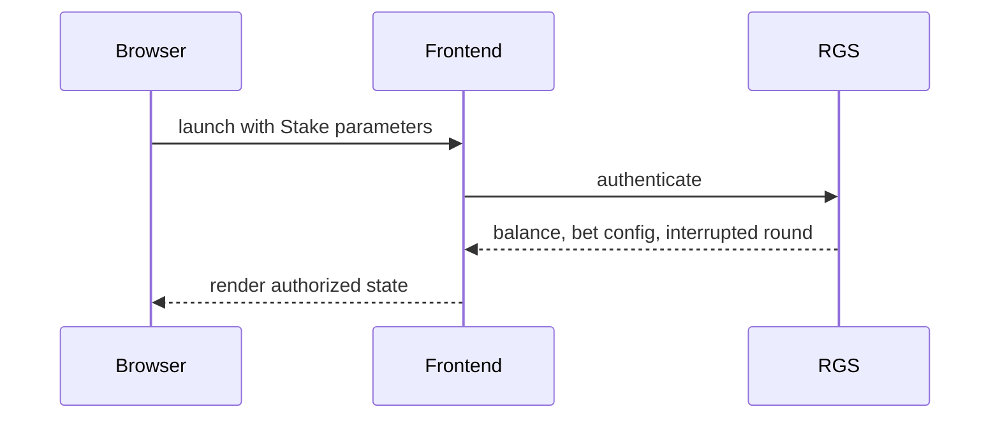
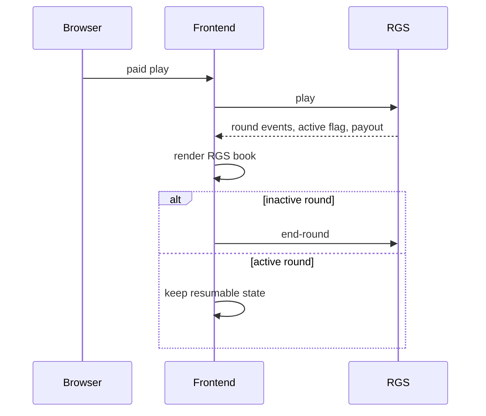
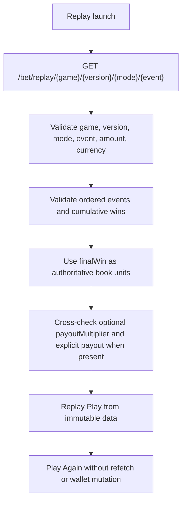
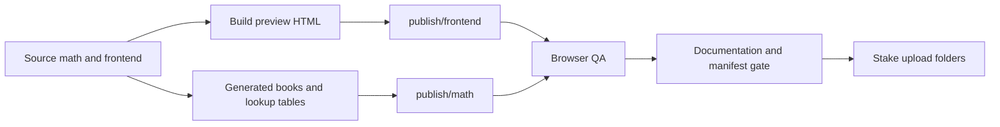

# Stake architecture and RGS flow

Authoritative rule: RGS mode never uses local RNG for authoritative results. `round.active`, not win/loss, controls settlement. Replay mode never authenticates and never mutates wallet or session state.

## Lifecycle diagrams

## Endpoint contract

| Endpoint | Method | Allowed | Forbidden | Authoritative fields | State transition | Failure behavior | Tests |
| --- | --- | --- | --- | --- | --- | --- | --- |
| /authenticate | POST | RGS paid launch | Replay launch | balance, bet levels, active round | unauthenticated to authenticated | fatal launch error | stake:qa, wallet E2E |
| /play | POST | Paid spin, bonus purchase, feature action | Replay Play, Play Again | events, payout, round.active | idle to rendering/resumable | fatal wallet error | stake:qa, major-actions E2E |
| /end-round | POST | inactive completed RGS round requiring settlement | replay and active resumable rounds | balance, round closed state | active/inactive to settled | visible fatal settlement error | stake:qa interrupted-round |
| /event/save | POST | No production replay use | Replay launch and replay playback | none for replay | no mutation | blocked in replay tests | replay forbidden-network E2E |
| /bet/replay/{game}/{version}/{mode}/{event} | GET | Replay launch including Event ID 0 | Paid play mutation | events, finalWin, amount, currency, optional payoutMultiplier | loading to ready | replay error overlay, no fallback | stake:qa replay |

Visible wins come from authoritative RGS events. `finalWin` is authoritative for replay result book units. A present `payoutMultiplier` is a cross-check only; absent or null values are reconstructed from validated `finalWin`; contradictory present values are rejected.

## Validation context

- Frontend build ID: `e5a3eaf118eb4f89aa83c0315cc6adc1acd2d1f7ef479879eb21d0b80f566b8e`
- Math version: `0.2.2-cluster`
- Evidence directory: `artifacts/stake-qa/2026-07-13T11-24-32-904Z`
