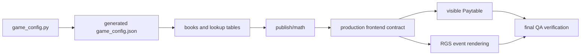

# Stake math and paytable contract

Single source chain:

Current math version: `0.2.2-cluster`

The authoritative publish math files are `publish/math/game_config.json`, `publish/math/index.json`, each `*_books.jsonl.zst`, each `*_lookup.csv`, and the RTP audit files. Their hashes are in `artifacts/stake-qa/publish-math-manifest.json`.

Stake discrepancy: old visible Paytable values drifted from production math. Production math defined K 5-6 as 0.48, Q 5-6 as 0.36 and J 7-8 as 0.56, so the reported round displayed 0.48 / 0.36 / 0.56. Those values are authoritative because they come from `math/games/golden_goal_rush/library/configs/game_config.py`, generated `publish/math/game_config.json` and the browser paytable contract evidence.

The contract covers RTP per mode, Max Win per mode, paytable cluster thresholds, size boosts, cascade multipliers, Wild substitution, Wild-only groups, deterministic target evaluation, removal-coordinate de-duplication and API/book payout units. Paytable drift is detected by `scripts/stake-qa.mjs paytable`, browser paytable E2E and the documentation manifest gate.

Full math regeneration is mandatory when production math files, cluster logic, Paytable values, RTP configuration, lookup generation, book generation or Wild evaluation semantics change. A replay-only frontend correction requires fresh `publish/frontend`, publish/math consistency checks, Paytable contract checks and exact published frontend browser tests; it does not by itself require millions of math rounds to be regenerated.

## Validation context

- Frontend build ID: `348cbfd4f1e28202a96f3aee3b5cb3349a1279474d4f6e19f3f16c3642eb857e`
- Math version: `0.2.2-cluster`
- Evidence directory: `artifacts/stake-qa/2026-07-13T12-26-21-463Z`
